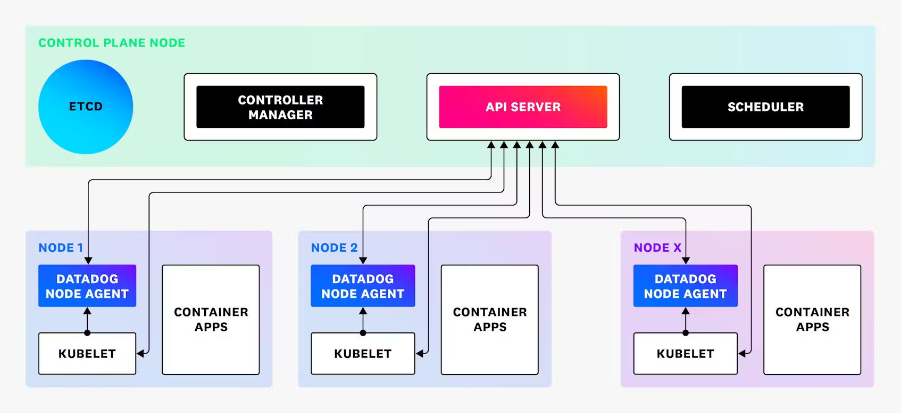
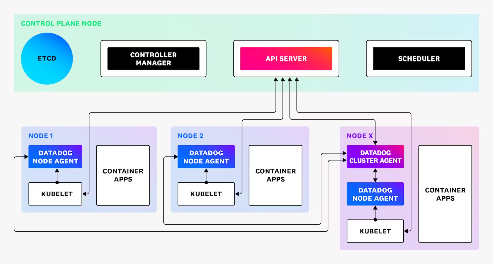

# <!--fit--> Kubernetes, Datadog, and the Learning Center

A Training and Customer Education
brown bag presentation 

<!-- This is presenter note. You can write down notes through HTML comment. -->
---

# Kubernetes

---

## A Self-Hosted Kubernetes Cluster

---

## ... with a Node Agent DaemonSet

---

## ... and a Cluster Agent

---

## Cloud Clusters

- Google Kubernetes Engine (GKE)
- Amazon Elastic Kubernetes Service (EKS)
- Azure Kubernetes Service (AKS)
- DigitalOcean Kubernetes
- Red Hat OpenShift
- ... lots more

---

## Deploying Datadog to Kubernetes

### Kubernetes resources

- Node Agent DaemonSet
- Cluster Agent Deployment
- Services
- ServiceAccounts
- RBAC roles and bindings

---

## Deploying Datadog to Kubernetes

### Methods
- Manifests
- Helm chart
- The Operator ⬅️ 

---

# Kubernetes and the Learning Center

---

## Kubernetes and the Learning Center

1. Teaching Kubernetes
2. Teaching anything else

---

## Teaching Kubernetes

### `instruqt-k8s` image 

  - Self-hosted Kubernetes 1.27 cluster
    - Control Plane node
    - n worker nodes
  - Ideal for teaching how to monitor entire clusters, including the control plane
  - Very hard to create and update
  - Slow to start up
  - Resource hungry

---

## Teaching Kubernetes

### Lightweight Alternatives

- Minikube
- k3s
- MicroK8s
- Kind (Kubernetes IN Docker)
- Rancher K3d

---

## Teaching Kubernetes

### Lightweight Alternatives

Do they provide real-world cluster monitoring experiences?

**TBD**

---

## Teaching anything else

We currently use Docker Compose in 
our non-Kubernetes labs

*But...*

Kubernetes is the overwhelming choice for 
container orchestration in production

