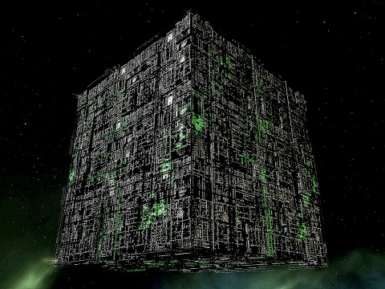

# <!--fit--> Kubernetes, Datadog, and the Learning Center

A Training and Customer Education
brown bag presentation 

<style scoped>a { color: #36c; }</style>

---
<!-- class: invert -->
# Kubernetes
A highly scalable, resilient, production-grade container orchestration platform.

<!-- Let's talk about Kubernetes first -->
---

   

<!-- 
- In the 2000s, Google started orchestrating containers using an internal project called Borg 
- Around 2013, the next generation of the project was called Seven, for Seven of Nine
- It was open sourced as Kubernetes in 2014. Simply a name that made sense and Google's lawyers would approve
- The logo wheel has 7 points
-->
---

## <!--fit-->  A Self-Hosted Kubernetes Cluster


<!-- 
- This is a simplified diagram of a Kubernetes cluster
- This what our `instruqt-k8s` image provides
- [Summarize the control plane parts and kubelet]
-->

---

## ... with a Node Agent DaemonSet


<!-- 
- You can deploy the good old Datadog Agent as a DaemonSet. 
It will realize it's running on a Kubernetes node and start monitoring the node and the containers running on it.
- It will also communicate with the API server to get information about the cluster and the workloads running on it.
- If you have a lot of nodes, that's a lot of requests to the API by each node agent.
-->

---

## <!--fit--> ... and a Cluster Agent Deployment


<!--
- The cluster agent was created primarily to consolidate node agent requests to the API server 
- It also enriches the data collected by the node agents with cluster-level information
-->
---

## Cloud Clusters

- Google Kubernetes Engine (GKE)
- Amazon Elastic Kubernetes Service (EKS)
- Azure Kubernetes Service (AKS)
- DigitalOcean Kubernetes
- Red Hat OpenShift
- ... lots more

<!--
- You can run Kubernetes node on almost anything, even Raspberry PIs. 
- And of course, the cloud. Here are just a few of the managed Kubernetes services available.
-->
---

## Deploying Datadog to Kubernetes

### Kubernetes resources

- Node Agent DaemonSet
- Cluster Agent Deployment
- Services
- ServiceAccounts
- RBAC roles and bindings

<!--
- The Datadog Agent and Cluster Agent consist of a number of Kubernetes resources
- There are a few ways to create them...
-->
---

## Deploying Datadog to Kubernetes

### Methods
- Manifests
- Helm chart
- The Operator ⬅️ 

<!--
- Manifests are YAML files that define the resources and workloads that will 
run on the nodes as pods
- Helm charts are like package managers for Kubernetes. They provide a layer of abstraction over manifests and can be used to deploy complex applications
- The Operator is a Kubernetes custom resource that manages the lifecycle of a complex application. It's like a Helm chart on steroids. 
-->
---

# Kubernetes and the Learning Center

---

## Kubernetes and the Learning Center

1. Labs where Kubernetes is the point
2. Labs where Kubernetes is a detail

<!-- 
- Two context for using Kubernetes in the Learning Center
- The first is where the lab is about Kubernetes itself, especially the control plane
- The second is where Kubernetes runs the lab services
-->
---

## Teaching Kubernetes

### `instruqt-k8s` image 

  - Self-hosted Kubernetes 1.27 cluster
    - Control Plane node
    - n worker nodes
  - Ideal for teaching how to monitor entire clusters, including the control plane
  - Very hard to create and update 
  - Slow to start up
  - Resource hungry

<!-- 
We have one Kubernetes image that provides a real-world, self-hosted Kubernetes cluster
-->
---

## Teaching Kubernetes

### Lightweight Alternatives

- Minikube
- k3s
- MicroK8s
- Kind (Kubernetes IN Docker)
- Rancher K3d

<!--
- There are lots of lightweight alternatives to this environment
- Faster startup
- Easier maintenance
- Less resource hungry
-->
---

## Teaching Kubernetes

### Lightweight Alternatives

Do they provide real-world cluster monitoring experiences?

🤷‍♀️ **TBD**

<!--
- These can all provide multi-node clusters
- They all have control planes
-->

---

## Teaching with Kubernetes

We currently use Docker Compose in 
our non-Kubernetes labs

*But...*

Kubernetes is the overwhelming choice for 
container orchestration in production

<!--
- Is a lightweight Kubernetes environment an appropriate container 
  orchestration platform for general tracks?
- Let's see what that would look like...
-->
---
## Teaching with Kubernetes

### With Docker Compose
```yaml
docker compose up docker-compose.yaml -d
```  

### With Kubernetes
```yaml
kubectl apply -f app/
```  

Where `app/` is a directory containing manifests for each service. 

<!-- 
- Still YAML
- You can create a monolithic manifest that defines all the services, but 
  you can also create a manifest for each service.
-->

---

## Teaching with Kubernetes

### With Docker Compose
```yaml
docker-compose up -d --no-deps --force-recreate frontend
```  

### With Kubernetes
```yaml
kubectl apply -f app/frontend.yaml
```  

<!-- 
- Redeploying a service is a little more elegant
- Mounting host resources is an anti-pattern
-->

---

## Teaching with Kubernetes

How resource intensive are the lightweight Kubernetes environments compared to Docker Compose?

🤷‍♀️ **It depends.**

---

## Teaching with Kubernetes
As a drop-in replacement for all of our labs, any form of Kubernetes would likely consume more resources than Docker Compose.

---

## Teaching with Kubernetes
But for some use cases, Kubernetes would make sense despite this:
 - Scaling. Labs with dozens (or hundreds!) of containers
 - Complex networking
 - Deployments (CI/CD, Canary testing, etc.)

 <!--
 - A good scaling use case is teaching tagging strategies
 -->

---
## Summary

- Kubernetes is complex, and so is monitoring it
- We need a real-world Kubernetes environment for teaching advanced Kubernetes
- We can probably use lightweight Kubernetes in some Kubernetes labs
- Using lightweight Kubernetes in non-Kubernetes labs is a trade-off
  - Closer to real-world
  - Likely more resource intensive
  - But opens up a lot of new narrative and technical possibilities

---
